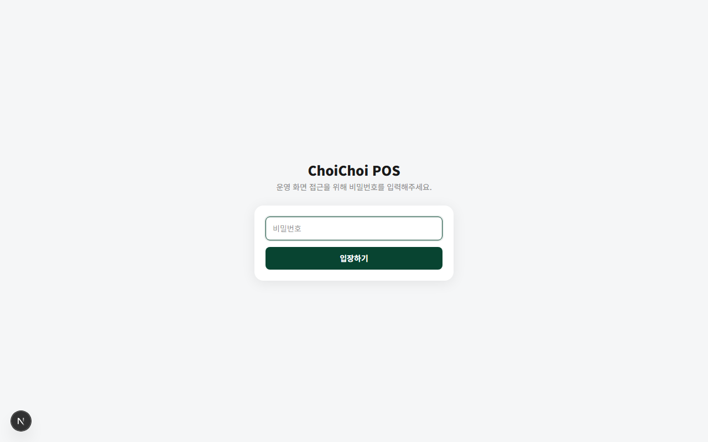
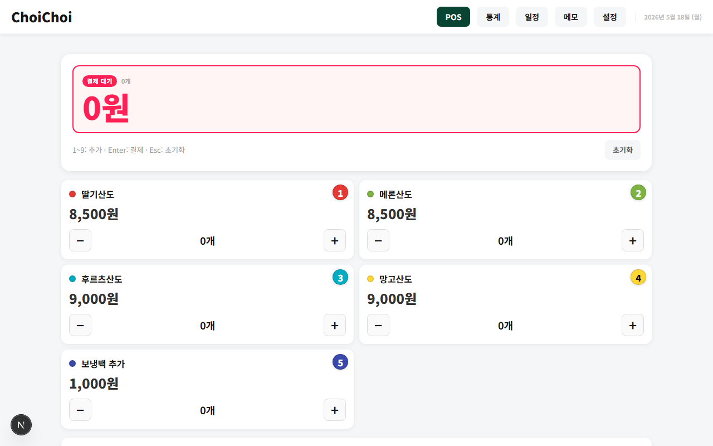
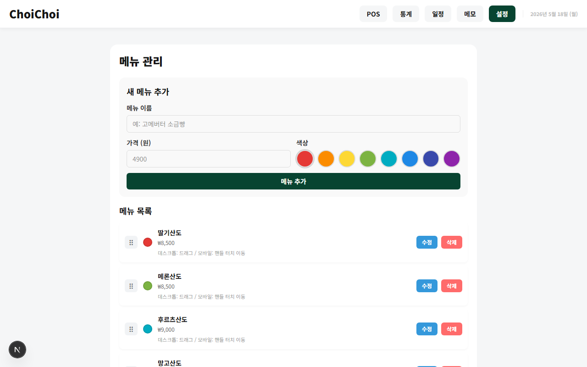
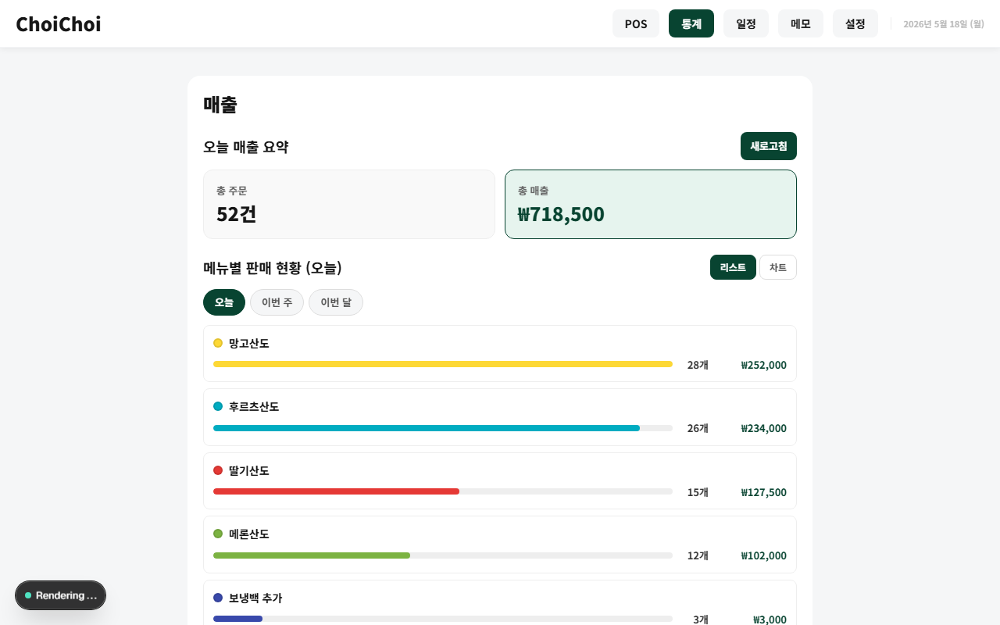
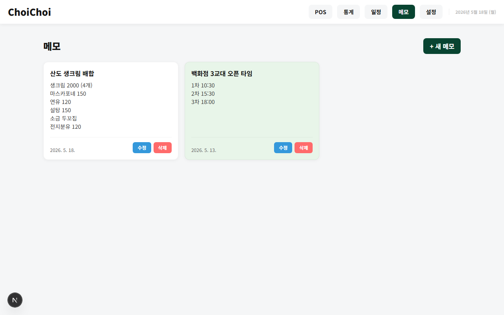
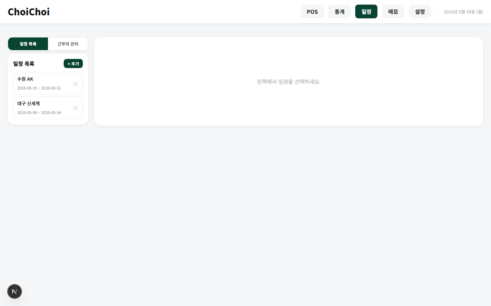

# ChoiChoi POS

한국 카페/베이커리를 위한 웹 기반 POS 시스템입니다. 터치·키보드 친화적인 메뉴 주문, Supabase 기반 결제 처리, 관리자용 메뉴 CRUD·매출 통계·일정·메모 기능을 제공합니다.

## 기술 스택

| 영역 | 기술 |
|------|------|
| 프레임워크 | Next.js 16 (App Router) |
| UI | React 19 + Tailwind CSS 4 |
| 데이터베이스 | Supabase (PostgreSQL) |
| 상태 관리 | TanStack Query v5 |
| 언어 | TypeScript 6 |
| 배포 | Vercel |

## 환경 변수

`.env` 파일에 아래 변수를 설정합니다.

```env
POPUP_PASSWORD=...          # POS 운영 화면 접근 비밀번호
ADMIN_PASSWORD=...          # 관리자 전용 페이지 비밀번호
NEXT_PUBLIC_SUPABASE_URL=...
NEXT_PUBLIC_SUPABASE_ANON_KEY=...
```

## 실행

```bash
yarn install
yarn dev    # http://localhost:3000
```

---

## 화면 구성

### 1. POS 입장 — 비밀번호 게이트

운영 화면 접근 전 비밀번호를 입력합니다. 인증 토큰은 배포 단위로 발급되어, 비밀번호 변경 또는 재배포 시 기존 세션이 자동 만료됩니다.



---

### 2. POS 메인 화면

메뉴 그리드에서 항목을 선택해 주문을 구성하고 결제합니다.

- 숫자키 `1`–`9` 단축키로 빠른 수량 추가
- `Enter` 결제 / `Esc` 초기화
- 현금·카드 결제 수단 선택
- 상단 배너에서 실시간 결제 대기 금액 확인



---

### 3. 관리자 인증

관리자 전용 페이지(통계·일정·메모·설정) 접근 시 별도 비밀번호를 요구합니다.


---

### 4. 설정 — 메뉴 관리

메뉴 항목을 추가·수정·삭제합니다.

- 이름, 가격, 색상 설정
- 드래그(PC) / 핸들 터치(모바일)로 표시 순서 변경
- 삭제 시 소프트 딜리트(`is_active = false`)로 주문 이력 보존



---

### 5. 통계 — 매출 현황

일별·주별·월별 매출을 확인합니다.

- 오늘 총 주문 건수 및 총 매출 요약
- 메뉴별 판매량 바 차트 / 리스트 전환
- 월간 캘린더로 일별 매출 흐름 파악
- 재료비·기타 비용 입력으로 순이익 계산



---

### 6. 메모

운영 중 필요한 메모를 자유롭게 기록합니다. 레시피, 오픈 타임 등 반복 참조 정보를 카드 형태로 저장합니다.



---

### 7. 일정

팝업 스토어·행사 등 일정과 근무자를 관리합니다.

- 일정 목록 추가·삭제
- 근무자 관리 탭에서 직원별 시급·배정 설정



---

## 프로젝트 구조

```
app/
├── page.tsx              # POS 메인
├── (admin)/
│   ├── settings/         # 메뉴 관리
│   ├── stats/            # 매출 통계
│   ├── memo/             # 메모
│   └── schedule/         # 일정
├── api/auth/
│   ├── admin/            # 관리자 인증 + 토큰 발급/검증
│   └── verify/           # POS 인증 + 토큰 발급/검증
├── admin-gate.tsx        # 관리자 인증 게이트 컴포넌트
├── password-gate.tsx     # POS 인증 게이트 컴포넌트
└── actions.ts            # 모든 Supabase 호출 (Server Actions)

lib/
└── supabase.ts           # Supabase 클라이언트 + DB 유틸

components/
└── MenuGrid.jsx          # 메뉴 그리드 컴포넌트
```

## 데이터베이스 스키마

| 테이블 | 주요 컬럼 |
|--------|-----------|
| `menu_items` | `id`, `name`, `price`, `color`, `stock`, `is_active`, `display_order` |
| `orders` | `id`, `total_price`, `payment_method`, `payment_status`, `created_at` |
| `order_items` | `order_id`, `menu_item_id`, `quantity`, `unit_price`, `subtotal` |
