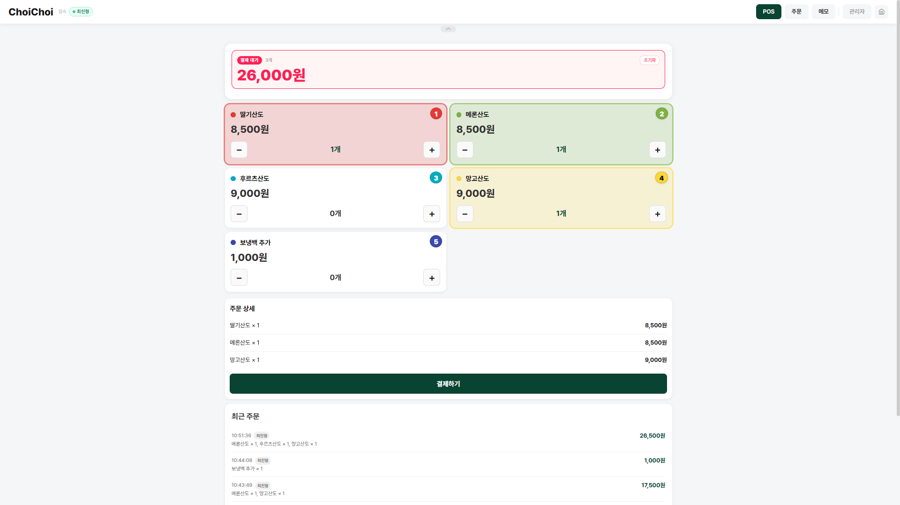
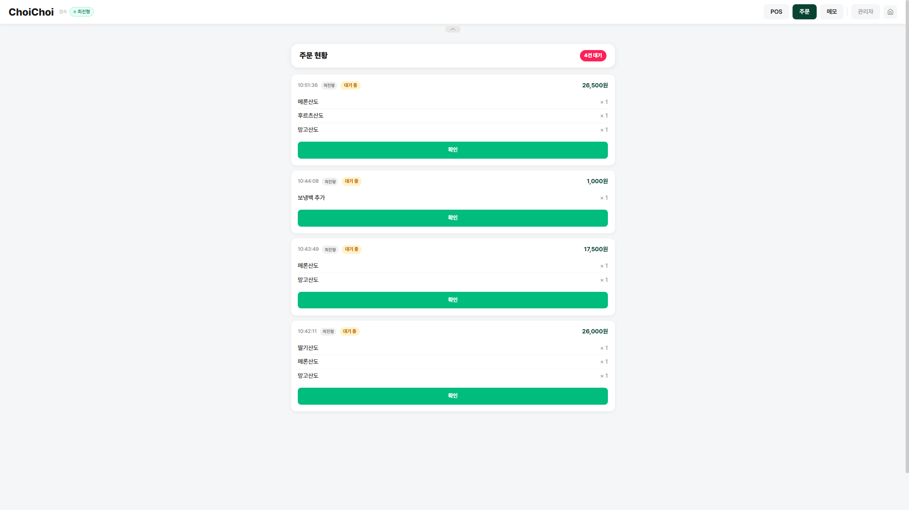
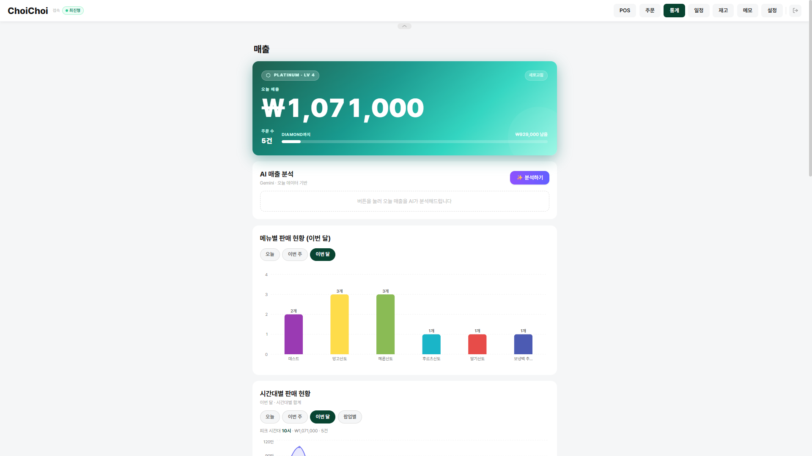
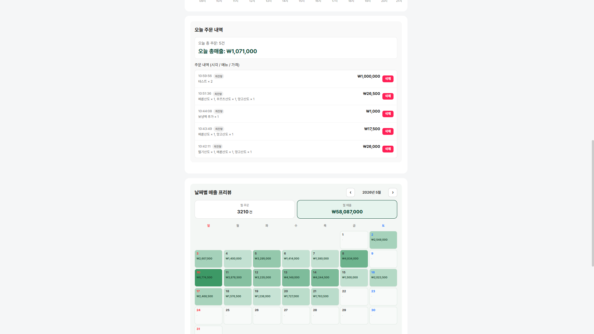
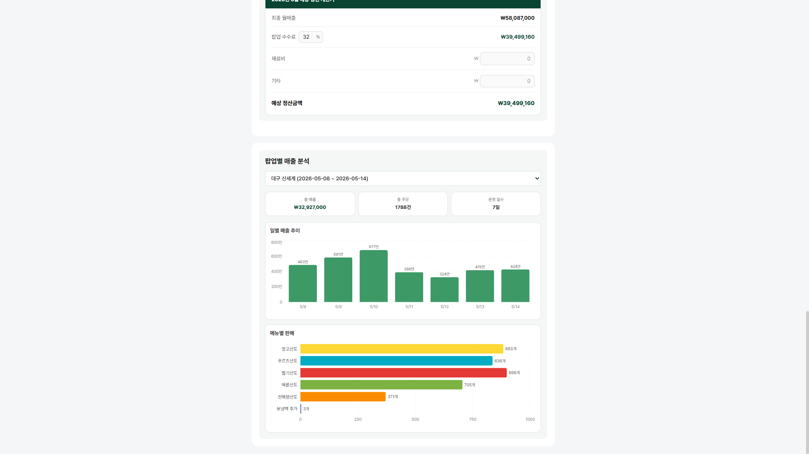
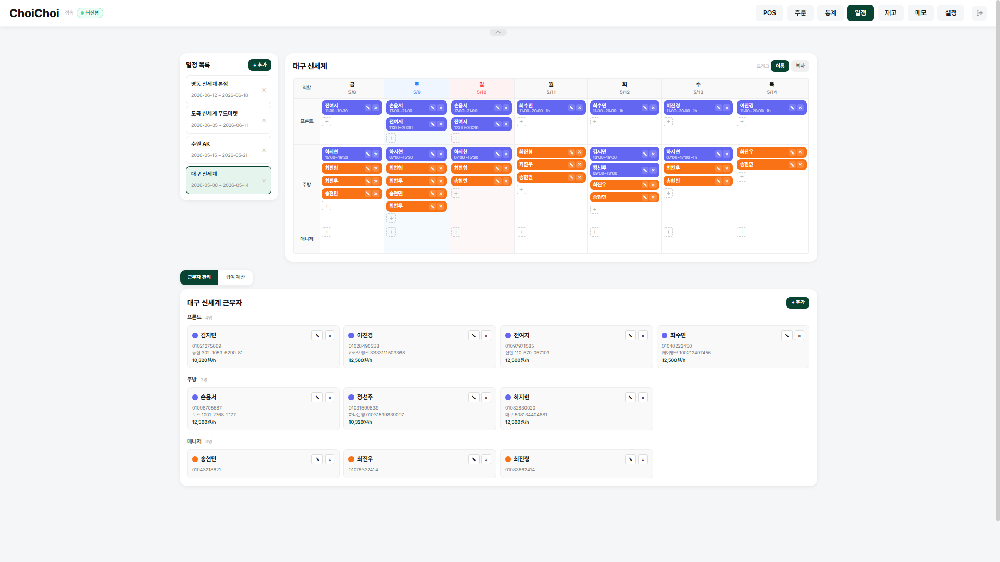
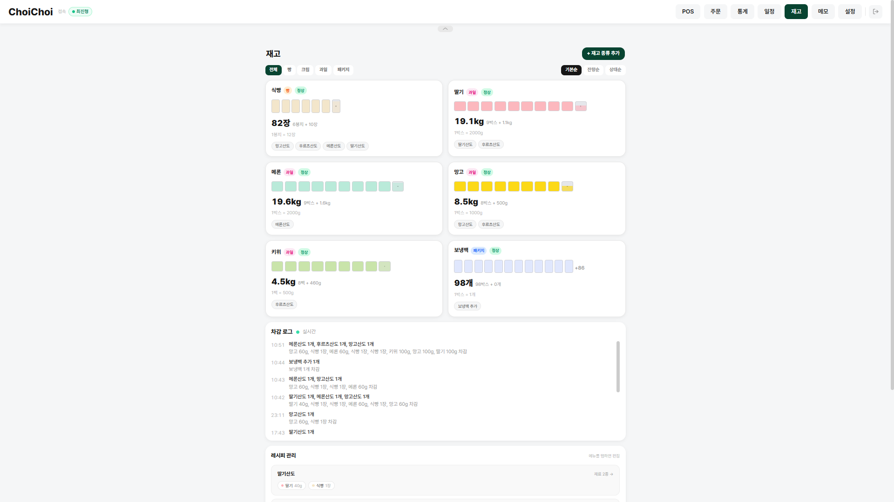
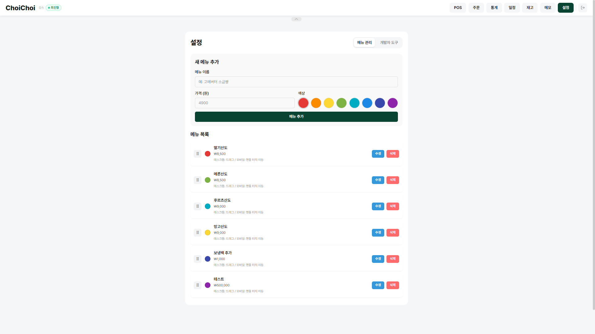

# ChoiChoi POS

한국 카페·베이커리 팝업스토어를 위한 웹 기반 POS 시스템.
터치·키보드 친화적인 캐셔 화면, 고객 실시간 디스플레이, 재고 관리, 일정·급여, 근로계약서 전자서명, AI 매출 분석, 어드민 통계 기능을 제공합니다.

---

## 스크린샷

<table>
  <tr>
    <td align="center"><b>POS 캐셔 화면</b><br/></td>
    <td align="center"><b>주문 현황</b><br/></td>
  </tr>
  <tr>
    <td align="center"><b>매출 통계 — 오늘·메뉴별·시간대별</b><br/></td>
    <td align="center"><b>매출 통계 — 주문 내역·월간 캘린더</b><br/></td>
  </tr>
  <tr>
    <td align="center"><b>매출 통계 — 팝업별 분석·정산</b><br/></td>
    <td align="center"><b>일정 관리 — 팝업·근무자 배정</b><br/></td>
  </tr>
  <tr>
    <td align="center"><b>재고 관리 — 식재료·레시피·차감 로그</b><br/></td>
    <td align="center"><b>설정 — 메뉴 CRUD·순서 변경</b><br/></td>
  </tr>
</table>

---

## 기술 스택

| 영역 | 기술 | 선택 이유 |
|------|------|-----------|
| 프레임워크 | Next.js 16 (App Router) | Server Actions로 서버·클라이언트 경계 최소화, 별도 API 서버 불필요 |
| 언어 | TypeScript 6 | Server Action 반환 타입을 클라이언트까지 end-to-end 보장 |
| UI | React 19 + Tailwind CSS 4 + Framer Motion | 선언형 애니메이션, 서버 컴포넌트와 병행 |
| 인증 | Supabase Auth (이메일+비밀번호) | 직원·관리자 단일 계정 시스템, `proxy.ts`에서 role 기반 라우트 보호 |
| 실시간 | Supabase Realtime Broadcast + Presence | WebSocket 인프라 직접 관리 불필요, Vercel 서버리스 완전 호환 |
| 데이터베이스 | Supabase (PostgreSQL) | RLS + service role 분리로 최소 권한 원칙 구현 |
| 서버 상태 | TanStack Query v5 | Optimistic update + 쿼리 캐시 무효화로 낙관적 UI |
| PDF 생성 | @react-pdf/renderer | 근로계약서를 서버에서 렌더링, 클라이언트 미리보기는 동일 컴포넌트 재사용 |
| AI | Google Gemini 2.5 Flash | 팝업 매출 데이터를 운영 인사이트 텍스트로 요약 |
| 배포 | Vercel | Edge 네트워크 |

---

## 아키텍처 결정 기록

### Server Actions vs API Routes
**결정:** 모든 DB 호출을 Server Actions(`app/actions/`)로 통일
**이유:** API Routes는 별도의 `fetch` 호출과 직렬화가 필요하지만, Server Actions는 함수 호출처럼 사용하면서 번들에는 포함되지 않음. `wrap()` 헬퍼 하나로 모든 에러를 `ApiResponse<T>` 형태로 일관되게 처리 가능.

도메인별 파일로 분리해 관심사 분리와 유지보수성을 개선했습니다.

```
app/actions/
├── _base.ts       # wrap() 헬퍼, 공통 에러 처리
├── menu.ts        # 메뉴 CRUD
├── orders.ts      # 주문 저장·조회·삭제
├── stats.ts       # 매출 통계, 수동 매출 입력
├── inventory.ts   # 재고 차감·입고·레시피
├── schedule.ts    # 팝업·근무자 일정
├── workers.ts     # 직원 계정·프로필·초대코드 회원가입
├── contracts.ts   # 근로계약서 생성·전자서명·삭제
├── cheers.ts       # 응원 카운터
├── gemini.ts       # AI 매출 분석
├── discord.ts      # Discord 알림
└── memos.ts        # 운영 메모
```

### 임시 비밀번호·토큰 인증 → Supabase Auth 단일 시스템 전환
**결정:** 직원용 env 비밀번호 + localStorage 토큰 방식을 폐기하고, 직원·관리자 모두 Supabase Auth(이메일+비밀번호) 계정으로 통일
**이유:** 기존 방식은 인원이 늘어날수록 비밀번호 공유 운영이 번거롭고, 누가 로그인했는지 서버에서 식별할 수 없었음(이름을 자율 입력). Supabase Auth로 전환하면서 `user_metadata.role`로 권한을 구분하고, 회원가입은 초대 코드(`SIGNUP_CODE`)로만 제한해 가입 자체는 막지 않으면서 무분별한 외부 가입을 방지함. 초기 비밀번호를 전화번호로 설정해 별도 안내 비용 없이 온보딩.
**트레이드오프:** 비밀번호 재설정 플로우(이메일 발송)는 아직 없음 — 현재는 운영자가 Supabase 대시보드에서 직접 처리.

### Broadcast vs DB Polling
**결정:** 카트 상태 동기화에 Supabase Realtime Broadcast 사용
**이유:** 카트는 결제 전까지 휘발성 데이터 — DB에 저장할 이유가 없음. Broadcast는 DB I/O 없이 WebSocket으로 중계되며, Vercel 서버리스 함수 재시작에도 영향받지 않음.

### Service Role Key 격리
**결정:** `lib/supabase-admin.ts`를 별도 모듈로 분리
**이유:** `NEXT_PUBLIC_` 접두사 실수를 물리적으로 방지. 파일 자체가 Server Actions에서만 import되므로 클라이언트 번들에 절대 포함되지 않음. anon 클라이언트(`supabase-browser.ts`, `supabase-server.ts`)와 admin 클라이언트(`supabase-admin.ts`)의 역할을 코드 레벨에서 명확히 분리.

### 근로계약서 PDF — 서버 렌더 + JSONB 원본 보관
**결정:** PDF는 항상 서버(`@react-pdf/renderer`의 `renderToBuffer`)에서 생성하고, 작성 시점의 폼 데이터 전체를 `contracts.contract_data`(JSONB)에 함께 저장
**이유:** 근로자가 전자서명을 할 때 사업주가 입력한 모든 항목(시급, 근무일, 보험 적용 여부 등)을 그대로 보존한 채로 서명 정보만 덧붙여 PDF를 재생성해야 함. 별도 폼 데이터 저장소 없이 PDF만 저장했다면 서명 시점에 원본 데이터를 복원할 방법이 없음. 미리보기(`PDFPreviewPanel`)는 동일한 `ContractDocument` 컴포넌트를 클라이언트에서 그대로 재사용해 작성 화면과 최종 PDF의 시각적 불일치를 원천적으로 제거.

### 소프트 딜리트
**결정:** 메뉴 삭제 시 `is_active = false`
**이유:** `order_items.menu_item_id`는 `menu_items.id`를 FK로 참조함. 하드 딜리트 시 과거 주문의 FK가 깨져 통계 집계 불가. 소프트 딜리트로 주문 이력·매출 정합성을 영구 보존.

---

## 실시간 동기화 아키텍처

캐셔와 고객 화면은 Supabase Realtime Broadcast로 DB 저장 없이 WebSocket 중계합니다. Vercel 서버리스와 완전 호환됩니다.

```
캐셔 (/pos)                                  고객 (/display)
┌────────────────────────┐                  ┌────────────────────────┐
│  counts 상태 변경       │  cart_update     │  보기 모드             │
│  → cart_update 송신    │ ──── Broadcast ──→│  실시간 카트 미러링    │
│                        │                  │  색상·수량·합계 표시   │
│  customer_update 수신  │←─── Broadcast ───│  주문 모드             │
│  → counts 업데이트     │  customer_update  │  메뉴 탭 → delta 송신  │
└────────────────────────┘                  └────────────────────────┘
       │  checkout_complete ──────────────────────────────→ 결제 완료 오버레이
       │                                                    + 컨페티 애니메이션
       └── Presence ──────────────────── 접속 중인 캐셔 목록 실시간 표시

채널명: orders-{popupId}, cart-display-{popupId}, presence-{cashierName}, cheers-{popupId}
```

---

## 인증 & 보안 설계

```
proxy.ts (Next.js 16, middleware.ts 대체)
  대상 경로: /stats, /schedule, /settings, /inventory, /devtools
  처리: supabase.auth.getUser()로 매 요청 검증
        미인증 또는 user_metadata.role !== 'admin' → /pos 리다이렉트

app/password-gate.tsx (클라이언트, 전체 페이지 wrap)
  공개 경로 (바이패스): /, /display
  로그인: supabase.auth.signInWithPassword() → user_profiles.worker_role 조회
          → user_metadata.role 동기화(admin/worker)
  회원가입: createWorkerAccount() 서버 액션 — 초대 코드(SIGNUP_CODE) 검증 후
            Auth 계정 생성 + user_profiles INSERT, 초기 비밀번호 = 전화번호

app/(admin)/layout.tsx (서버 컴포넌트)
  getSession()으로 추가 보호 — proxy.ts가 이미 세션을 검증했으므로
  네트워크 호출이 필요한 getUser() 대신 쿠키 직접 판독으로 충분
```

**클라이언트·서버 키 격리**

```
lib/supabase-browser.ts  ← ANON_KEY, 클라이언트 로그인/회원가입/스토리지 업로드
lib/supabase-server.ts   ← ANON_KEY, 서버 컴포넌트·서버 액션 인증 확인
lib/supabase-admin.ts    ← SERVICE_ROLE_KEY, Server Actions에서만 import
lib/supabase.ts          ← ANON_KEY, 클라이언트 실시간 채널 전용 싱글턴
```

`supabase-admin.ts`는 서버 전용 모듈로, 클라이언트 번들에 절대 포함되지 않습니다.

**알아둘 점:** 클라이언트의 `onAuthStateChange` 콜백 인자로 받는 `session`/`session.user`는 저장소(쿠키)에서 그대로 읽힌 값이라 위변조 가능성이 있다는 게 Supabase의 공식 경고입니다. role처럼 권한 판단에 쓰는 값은 콜백 안에서 `getUser()`를 다시 호출해 Auth 서버 검증을 한 번 더 거치도록 구현했습니다.

---

## 사용자 역할

| 역할 | 설명 | 접근 경로 |
|------|------|-----------|
| **손님** (Guest) | 주문하는 고객 | `/display` |
| **직원** (Worker) | 알바생·캐셔 | `/pos`, `/orders`, `/memo`, `/my` |
| **관리자** (Admin) | 운영 관리자 | 위 전체 + `/stats`, `/schedule`, `/settings`, `/inventory`, `/devtools` |

직원·관리자는 같은 Supabase Auth 계정 체계를 쓰고, `user_metadata.role`로만 권한이 구분됩니다.

---

## 프로젝트 구조

```
app/
├── page.tsx                   # 랜딩 — 역할 선택
├── password-gate.tsx          # 로그인/회원가입 게이트 (Supabase Auth)
├── providers.tsx               # TanStack Query Provider
├── actions/                    # Server Actions — 도메인별 파일로 분리
│   ├── _base.ts                # wrap() 헬퍼, 공통 에러 처리
│   ├── menu.ts / orders.ts / stats.ts / inventory.ts / memos.ts
│   ├── schedule.ts             # 팝업·근무자 일정
│   ├── workers.ts              # 직원 계정·프로필·초대코드 회원가입
│   ├── contracts.ts            # 근로계약서 생성·전자서명·삭제
│   ├── cheers.ts                # 응원 카운터
│   ├── gemini.ts                # AI 매출 분석 (Gemini 2.5 Flash)
│   └── discord.ts               # Discord 알림
├── pos/page.tsx                # 캐셔 POS 메인
├── display/page.tsx            # 고객 디스플레이 (보기/주문 모드)
├── memo/page.tsx                # 운영 메모
├── orders/page.tsx              # 주문 현황 (결제 확인·삭제)
├── my/page.tsx                  # 내 정보 — 프로필 수정, 주문 통계, 계약서 확인·서명
├── (admin)/
│   ├── layout.tsx               # getSession() 추가 보호
│   ├── stats/                   # 매출 통계 (커스텀 훅 분리 구조)
│   │   ├── _hooks/               # useCalendar, useTodayStats, useBreakdown ...
│   │   ├── _components/          # CalendarSection, ManualSalesModal ...
│   │   └── _lib/                  # period 유틸
│   ├── schedule/                 # 일정·급여 (드래그 배치 그리드 + 급여 계산서)
│   ├── settings/                 # 메뉴 관리 + 유저(근로계약서) 관리 + 개발자 도구
│   ├── inventory/                 # 재고 (식재료·레시피·입출고 로그)
│   └── devtools/                  # DB 상태·API 테스트
└── api/                          # (현재 라우트 핸들러 없음 — 인증은 Server Actions로 처리)

components/
├── NavBar.tsx                   # 네비게이션 (isAdmin 상태로 어드민 링크 노출)
├── SalesBanner.tsx               # 오늘 매출 배너 (티어별 그라데이션)
├── CheerPanel.tsx / FloatingEmojis.tsx   # 응원 기능 UI
├── ContractGenerateModal.tsx     # 근로계약서 작성 모달 (실시간 미리보기)
├── WorkerSignModal.tsx           # 근로자 전자서명 모달
├── PDFPreviewPanel.tsx           # usePDF 기반 라이브 PDF 미리보기
├── ContractDocument.tsx          # 표준근로계약서 PDF 템플릿
└── SignaturePad.tsx              # 캔버스 서명 입력

hooks/
└── usePresence.ts                # Supabase Presence — 접속 캐셔 목록 구독

lib/
├── supabase-browser.ts           # anon 클라이언트 (클라이언트 인증)
├── supabase-server.ts            # anon 클라이언트 (서버 인증 확인)
├── supabase-admin.ts             # service role 클라이언트 (서버 전용)
├── supabase.ts                   # anon 클라이언트 (실시간 채널 싱글턴)
├── tiers.ts                      # 매출 등급 시스템 정의
├── discord.ts                    # Discord 웹훅 알림
├── toast.ts                      # sonner 토스트 래퍼
└── utils.ts                      # formatPrice, parseWorkHours, calcWeeklyHolidayPay ...

types/
├── api.ts                        # ApiResponse<T>, 각 액션 반환 타입
└── database.ts                   # Supabase 테이블 인터페이스
```

---

## 데이터베이스 스키마

### 핵심 도메인

| 테이블 | 주요 컬럼 | 비고 |
|--------|-----------|------|
| `menu_items` | `id`, `name`, `price`, `color`(hex), `stock`, `is_active`, `display_order` | 소프트 딜리트 |
| `orders` | `id`, `total_price`, `payment_method`, `payment_status`, `cashier_name`, `is_prepared`, `created_at` | UTC 저장, KST 변환은 조회 시점에 처리 |
| `order_items` | `order_id`, `menu_item_id`, `quantity`, `unit_price`, `subtotal` | FK 보존 목적 |

### 재고 관리

| 테이블 | 주요 컬럼 | 비고 |
|--------|-----------|------|
| `ingredients` | `id`, `name`, `category`(`빵`\|`크림`\|`과일`\|`패키지`), `unit_type`(`count`\|`weight`), `sealed_count`, `opened_remaining`, `reorder_at_containers` | 봉·박스 이중 단위 |
| `recipes` | `menu_id`, `ingredient_id`, `qty_per_unit` | 메뉴↔재료 N:M |
| `deduction_events` | `id`, `order_id`, `ingredient_id`, `qty_deducted`, `created_at` | 주문 시 자동 생성 |
| `restock_events` | `id`, `ingredient_id`, `sealed_delta`, `opened_delta`, `note`, `created_by` | 수동 입고 기록 |

### 운영·인사 관리

| 테이블 | 주요 컬럼 | 비고 |
|--------|-----------|------|
| `popup_events` | `id`, `name`, `start_date`, `end_date` | 팝업 행사 단위 |
| `schedule_slots` | `id`, `event_id`, `schedule_date`, `role`, `person_name`, `work_time`, `break_time`, `worker_id` | 근무 배정. `work_time`은 `10:30-19:00`/`10:30~19:00` 두 구분자 혼재 |
| `workers` | `id`, `event_id`, `name`, `color`, `phone`, `bank_name`, `bank_account`, `hourly_rate`, `payment_done`, `worker_role`, `user_profile_id` | 팝업별 정산 단위. `user_profile_id`로 계정과 연결. `auth_user_id`/`health_cert_url`/`active_title_key`/`title_color` 컬럼도 있으나 코드에서 미사용(칭호 컬럼은 UI 미구현) |
| `user_profiles` | `id`, `name`, `phone`, `bank_name`, `bank_account`, `health_cert_url`, `worker_role`, `total_revenue` | Auth 계정 1:1 |
| `contracts` | `id`, `worker_id`, `popup_id`, `start_date`, `end_date`, `hourly_rate`, `pdf_url`, `pdf_hash`, `contract_data`(jsonb), `worker_address`, `worker_signed_at`, `issued_at` | 근로계약서. PDF는 Storage `contracts` 버킷(비공개) |
| `memos` | `id`, `title`, `content`, `color` | 캐셔 운영 메모 |
| `cheers` | `popup_id`, `worker_name`, `date`, `count` | 응원 카운터, 일자별 |
| `daily_sales` | `id`, `sale_date`(UNIQUE), `total_revenue`, `total_orders`, `note` | 수동 매출 입력 |

**주요 설계 결정:**
- `menu_items.is_active = false` — 소프트 딜리트, `order_items` FK 정합성 유지
- `orders.created_at` — UTC 저장, KST 변환은 `getKSTDateBounds()`로 조회 시점에 처리
- `daily_sales.sale_date` UNIQUE 제약 — upsert-on-conflict 보장
- `contracts.contract_data`(JSONB) — 서명 시점에 원본 폼 데이터를 복원해 PDF 재생성하기 위한 저장소

---

## 환경 변수

`.env.example`을 복사해 `.env`로 사용합니다.

```bash
cp .env.example .env
```

| 변수 | 용도 | 노출 범위 |
|------|------|-----------|
| `NEXT_PUBLIC_SUPABASE_URL` | Supabase 프로젝트 URL | 브라우저 공개 |
| `NEXT_PUBLIC_SUPABASE_ANON_KEY` | Supabase anon 키 | 브라우저 공개 |
| `SUPABASE_SERVICE_ROLE_KEY` | RLS 우회 admin 키 | **서버 전용** |
| `SIGNUP_CODE` | 회원가입 시 요구되는 초대 코드 | 서버 전용 |
| `DISCORD_WEBHOOK_URL` | 메뉴 변경/계약 서명/로그인 알림 (선택) | 서버 전용 |
| `GEMINI_API_KEY` | AI 매출 분석 (선택) | 서버 전용 |

관리자 계정은 Supabase 대시보드 → Authentication → Users에서 직접 등록 후 `user_profiles.worker_role`을 `admin`으로 설정합니다.

---

## 실행

```bash
yarn install
yarn dev      # http://localhost:3000
yarn build    # 프로덕션 빌드 (TypeScript 타입 검사 포함)
yarn lint     # ESLint 검사
```
