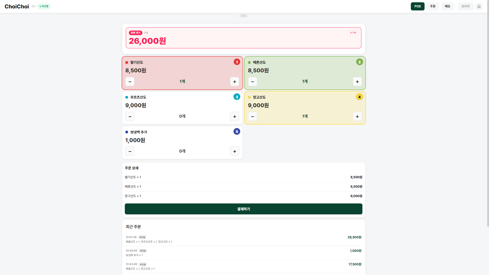
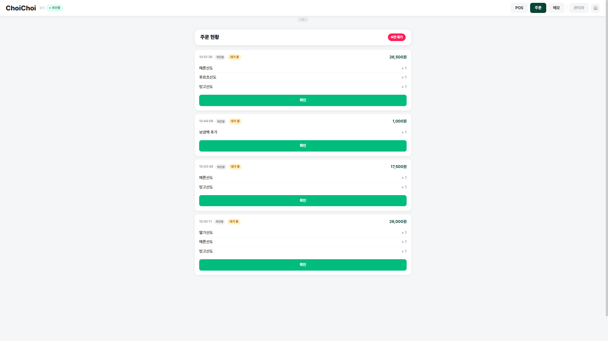
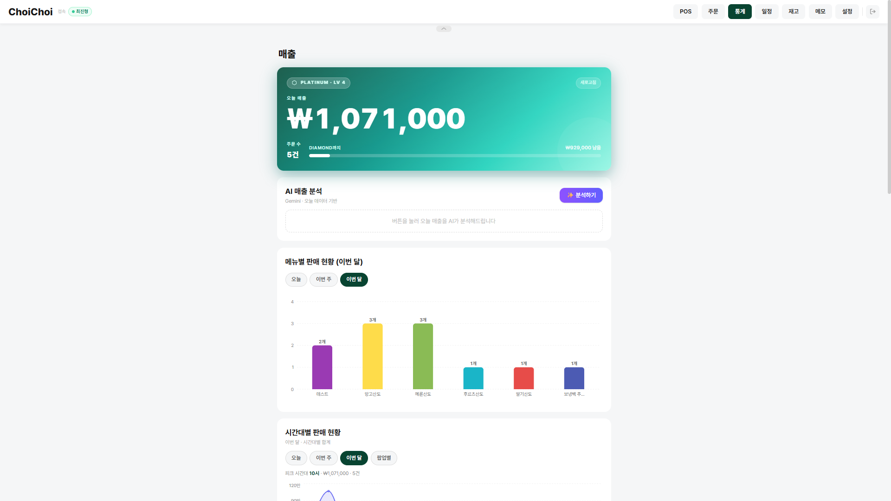
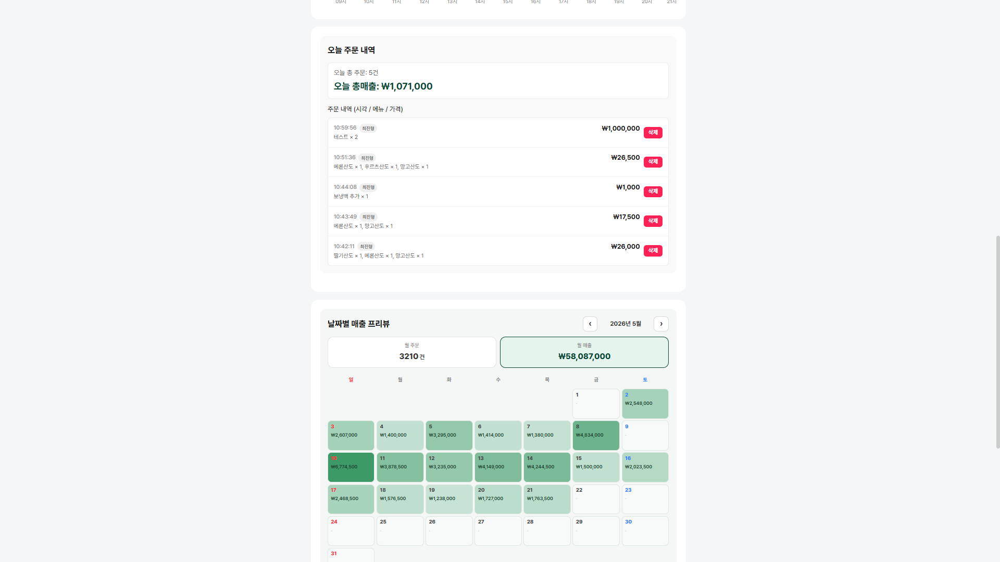
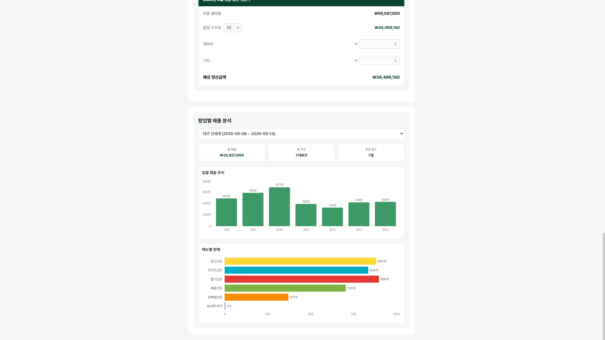
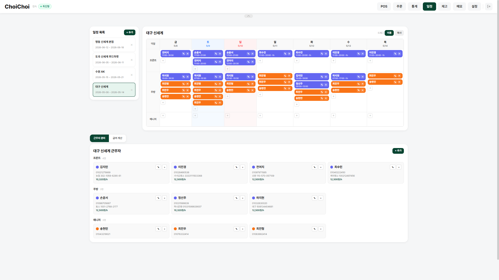
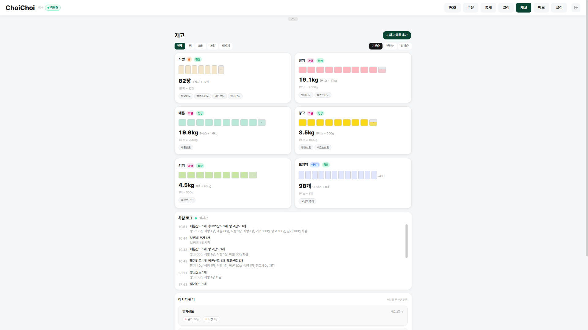
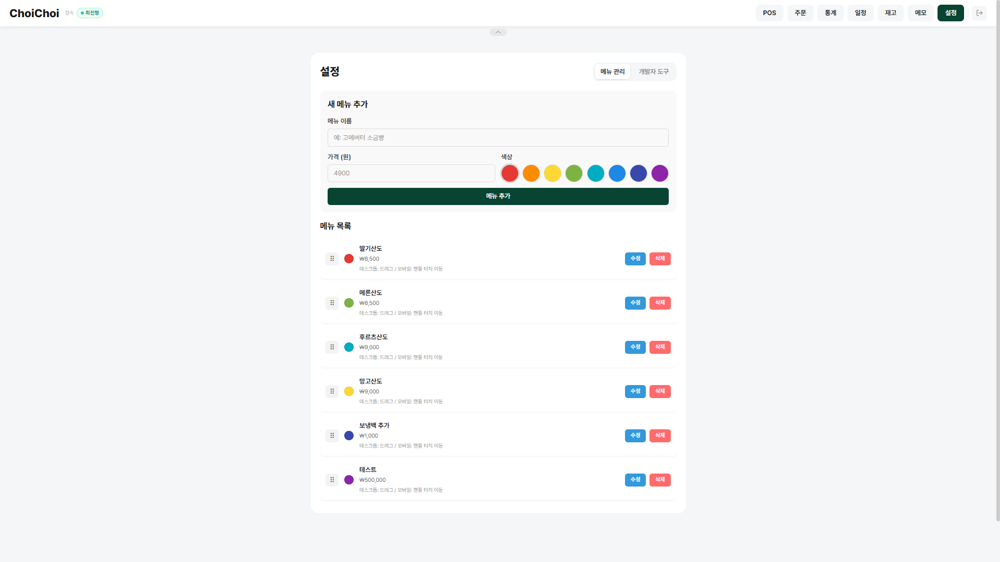

# Hiyorisando POS · ERP

전국 팝업스토어를 운영하는 베이커리 브랜드 **히요리산도(Hiyorisando)** — [@Hiyorisando_official](https://www.instagram.com/hiyorisando_official/) — 의 실제 매장 운영을 위해 만든 **사내(in-house) 웹 POS + 경량 ERP**입니다. 데모나 과제용 프로젝트가 아니라, 여러 팝업 매장에서 매일 결제·정산에 실사용 중인 시스템입니다.

주문 접수·결제(POS)부터 재고관리(Inventory), 인사관리(HRM) — 근무자 채용 후보 관리·파트별 로스터(근무표) 배정·급여(Payroll) 자동 정산·근로계약서 전자서명(E-signature) — 그리고 매출 통계까지, 팝업 매장 운영에 필요한 백오피스 업무 전체를 하나의 시스템에서 처리합니다.

---

## 핵심 기능

| 모듈 | 설명 |
|------|------|
| **POS** | 터치·키보드 친화적 캐셔 결제 화면, 메뉴별 재고 실시간 차감, 티어별 매출 배너·컨페티 |
| **고객 디스플레이** | 결제 없이 WebSocket으로만 중계되는 실시간 장바구니 미러링 화면 |
| **주문 현황** | 결제 완료 주문 조회·준비 상태 토글 |
| **재고관리(Inventory)** | 식재료 미개봉/개봉 잔량 이중 단위 추적, 입고 이력 |
| **인사관리(HRM)** | 근무자 후보/재직/불합격 상태 관리, 팝업·파트별 로스터 배정(드래그 없는 낙관적 업데이트 그리드), 다매장 근무자는 팝업 간 N:M 배정 테이블로 이력 추적 |
| **급여(Payroll)** | 휴게시간 자동 차감 기반 유급 근무시간 계산, 근무자별 정산액 산출 |
| **근로계약서 전자서명** | 표준근로계약서 PDF를 서버에서 실시간 생성·미리보기, 근무자가 앱에서 직접 서명 |
| **일정표** | 매니저용 주방·매장 통합 근무표 읽기 전용 조회 + 날짜별 메모 |
| **매출 통계** | 오늘/기간별 매출, 메뉴별·시간대별 분석, 월간 캘린더, 팝업별 정산 |
| **알림** | Discord 웹훅으로 계약 서명·로그인·익일 근무 배정 다이제스트 자동 발송(Vercel Cron) |

---

## 스크린샷

<table>
  <tr>
    <td align="center"><b>POS 캐셔 화면</b><br/></td>
    <td align="center"><b>주문 현황</b><br/></td>
  </tr>
  <tr>
    <td align="center"><b>매출 통계 — 오늘·메뉴별·시간대별</b><br/></td>
    <td align="center"><b>매출 통계 — 주문 내역·월간 캘린더</b><br/></td>
  </tr>
  <tr>
    <td align="center"><b>매출 통계 — 팝업별 분석·정산</b><br/></td>
    <td align="center"><b>일정표 — 파트별 로스터 배정</b><br/></td>
  </tr>
  <tr>
    <td align="center"><b>재고관리 — 식재료 입출고</b><br/></td>
    <td align="center"><b>설정 — 메뉴 CRUD·팝업 관리</b><br/></td>
  </tr>
</table>

---

## 기술 스택

| 영역 | 기술 | 선택 이유 |
|------|------|-----------|
| 프레임워크 | Next.js 16 (App Router) | Server Actions로 서버·클라이언트 경계 최소화, 별도 API 서버 불필요 |
| 언어 | TypeScript 6 | Server Action 반환 타입을 클라이언트까지 end-to-end 보장 |
| UI | React 19 + Tailwind CSS 4 + Framer Motion | 선언형 애니메이션, 서버 컴포넌트와 병행 |
| 서버 상태 | TanStack Query v5 | 낙관적 업데이트 + 쿼리 캐시 무효화 |
| 폼 검증 | Zod | Server Action 입력값 스키마 검증 |
| 차트 | Recharts | 매출 통계 시각화 |
| 인증 | Supabase Auth (이메일+비밀번호) | admin > manager > user 3단계 역할, `proxy.ts`에서 라우트 단위로 보호 |
| 실시간 | Supabase Realtime Broadcast + Presence | WebSocket 인프라 직접 관리 불필요, Vercel 서버리스와 완전 호환 |
| 데이터베이스 | Supabase (PostgreSQL) | RLS + service role 분리로 최소 권한 원칙 구현 |
| PDF 생성 | @react-pdf/renderer + pdfjs-dist | 근로계약서 서버 렌더링, 미리보기는 동일 컴포넌트 재사용(모바일은 pdfjs-dist 캔버스 렌더로 iframe PDF 뷰어 미지원 대응) |
| 테스트 | Vitest | 급여·근무시간 계산 등 순수 로직 단위 테스트 |
| 배포 | Vercel | Edge 네트워크 + Cron(익일 근무 배정 Discord 다이제스트) |

---

## 아키텍처 결정 기록

### Server Actions vs API Routes
**결정:** 모든 DB 호출을 Server Actions(`app/actions/`)로 통일, 어드민 전용 액션은 액션 내부에서도 역할 재검증
**이유:** API Routes는 별도의 `fetch` 호출과 직렬화가 필요하지만, Server Actions는 함수 호출처럼 사용하면서 클라이언트 번들에는 포함되지 않음. `wrap()` 헬퍼 하나로 모든 에러를 `ApiResponse<T>` 형태로 일관되게 처리. 단, Server Action은 실질적으로 공개 POST 엔드포인트라 `proxy.ts`의 페이지 보호가 적용되지 않으므로, 권한 변경·PII 조회 같은 민감한 액션은 `requireAdmin()`/`getManagerSession()` 패턴으로 액션 내부에서도 직접 역할을 검사.

```
app/actions/
├── _base.ts        # wrap() 헬퍼, 공통 에러 처리
├── menu.ts          # 메뉴 CRUD
├── orders.ts        # 주문 저장·조회·삭제
├── stats.ts         # 매출 통계, 수동 매출 입력
├── inventory.ts      # 재고 차감·입고
├── schedule.ts        # 팝업(매장) CRUD
├── staff.ts            # 근무자 후보/재직 프로필 관리
├── staffPopups.ts       # 근무자↔팝업 다대다 배정
├── roster.ts              # 파트 정의·날짜별 배정·티어 랭킹
├── roster-view.ts          # 매니저용 통합 일정표 읽기 전용 조회
├── payroll.ts                # 급여 정산 계산
├── workers.ts                 # 직원 계정·프로필·초대코드 회원가입
├── contracts.ts                # 근로계약서 생성·전자서명·삭제
├── pos-note.ts                  # POS 공지 메모
├── discord.ts                    # Discord 알림
└── memos.ts                       # 운영 메모
```

### 임시 비밀번호·토큰 인증 → Supabase Auth 단일 시스템 전환
**결정:** 직원용 env 비밀번호 + localStorage 토큰 방식을 폐기하고, 전 직원·관리자를 Supabase Auth(이메일+비밀번호) 계정으로 통일, `admin > manager > user` 3단계 역할 도입
**이유:** 기존 방식은 인원이 늘어날수록 비밀번호 공유 운영이 번거롭고, 누가 로그인했는지 서버에서 식별할 수 없었음. Supabase Auth로 전환하면서 역할 원본은 `user_profiles.worker_role`에 두고 로그인 시 `user_metadata.role`로 동기화. 회원가입은 초대 코드로만 제한. 초기 비밀번호를 전화번호로 설정해 별도 안내 비용 없이 온보딩하고, 비밀번호를 잊으면 관리자가 설정 탭에서 초기값으로 즉시 리셋 가능.

### Broadcast vs DB Polling
**결정:** 카트 상태 동기화에 Supabase Realtime Broadcast 사용
**이유:** 카트는 결제 전까지 휘발성 데이터 — DB에 저장할 이유가 없음. Broadcast는 DB I/O 없이 WebSocket으로 중계되며, Vercel 서버리스 함수 재시작에도 영향받지 않음.

### Service Role Key 격리
**결정:** `lib/supabase-admin.ts`를 별도 모듈로 분리
**이유:** `NEXT_PUBLIC_` 접두사 실수를 물리적으로 방지. 파일 자체가 Server Actions에서만 import되므로 클라이언트 번들에 절대 포함되지 않음. anon 클라이언트(`supabase-browser.ts`, `supabase-server.ts`)와 admin 클라이언트(`supabase-admin.ts`)의 역할을 코드 레벨에서 명확히 분리.

### 근로계약서 PDF — 서버 렌더 + JSONB 원본 보관
**결정:** PDF는 항상 서버(`@react-pdf/renderer`의 `renderToBuffer`)에서 생성하고, 작성 시점의 폼 데이터 전체를 `contracts.contract_data`(JSONB)에 함께 저장. `contracts.worker_id`는 근무자 단일 소스인 `staff_profiles.id`만 참조
**이유:** 근로자가 전자서명을 할 때 사업주가 입력한 모든 항목(시급, 근무일, 보험 적용 여부 등)을 그대로 보존한 채로 서명 정보만 덧붙여 PDF를 재생성해야 함. 미리보기(`PDFPreviewPanel`)는 동일한 `ContractDocument` 컴포넌트를 클라이언트에서 재사용해 작성 화면과 최종 PDF의 시각적 불일치를 제거. 과거에는 근무자 테이블이 이벤트 단위(`workers`)와 계정 단위로 이원화돼 있었으나, 독립된 id 공간이 충돌해 데이터가 오염된 적이 있어 `staff_profiles` 단일 참조로 정리.

### 다매장 근무자 모델링 — N:M 조인 테이블
**결정:** 근무자의 "현재 소속 팝업"은 `staff_profiles.popup_id`(단일값, 캐셔 전용)로 유지하되, 여러 팝업을 오간 이력은 `staff_popup_assignments`(근무자↔팝업 다대다) 테이블로 별도 추적
**이유:** 팝업스토어 특성상 한 사람이 시기별로 다른 매장에서 근무하는 경우가 흔함. 소속 팝업 단일값만으로는 과거 근무 이력을 표현할 수 없어, HR 탭의 "기존 근무자 추가" 기능이 이 조인 테이블 기반으로 동작하도록 별도 설계.

### 소프트 딜리트
**결정:** 메뉴 삭제 시 `is_active = false`
**이유:** `order_items.menu_item_id`는 `menu_items.id`를 FK로 참조함. 하드 딜리트 시 과거 주문의 FK가 깨져 통계 집계 불가. 소프트 딜리트로 주문 이력·매출 정합성을 영구 보존.

---

## 실시간 동기화 아키텍처

캐셔와 고객 화면은 Supabase Realtime Broadcast로 DB 저장 없이 WebSocket 중계합니다. Vercel 서버리스와 완전 호환됩니다.

```
캐셔 (/pos)                                  고객 (/display)
┌────────────────────────┐                  ┌────────────────────────┐
│  counts 상태 변경       │  cart_update     │  보기 모드             │
│  → cart_update 송신    │ ──── Broadcast ──→│  실시간 카트 미러링    │
│                        │                  │  색상·수량·합계 표시   │
│  customer_update 수신  │←─── Broadcast ───│  주문 모드             │
│  → counts 업데이트     │  customer_update  │  메뉴 탭 → delta 송신  │
└────────────────────────┘                  └────────────────────────┘
       │  checkout_complete ──────────────────────────────→ 결제 완료 오버레이
       │                                                    + 컨페티 애니메이션
       └── Presence ──────────────────── 접속 중인 캐셔 목록 실시간 표시

채널명: orders-{popupId}, cart-display-{popupId}, pos-presence-{popupId},
        pos-note-*(+ pos-note-editors Presence), inventory-*, stats-today-*, menu-items-stock-*
```

---

## 인증 & 보안 설계

```
proxy.ts (Next.js 16, middleware.ts 대체 — 동시 생성 시 충돌하므로 middleware.ts는 절대 생성 금지)
  admin 전용:   /stats, /hr, /settings
  manager 이상: /inventory, /roster
  처리: supabase.auth.getClaims()로 매 요청 JWT 로컬 검증(비대칭 키, JWKS 인스턴스 내 캐시)
        — getUser()의 매 요청 Auth 서버 왕복 제거
        미인증 또는 권한 부족 → /pos 리다이렉트

app/password-gate.tsx (클라이언트, 전체 페이지 wrap)
  공개 경로 (바이패스): /, /display
  로그인: supabase.auth.signInWithPassword() → user_profiles.worker_role 조회
          → user_metadata.role 동기화(admin/manager/user)
  회원가입: createWorkerAccount() 서버 액션 — 초대 코드 검증 후
            Auth 계정 생성 + user_profiles INSERT, 초기 비밀번호 = 전화번호

app/(admin)/layout.tsx, app/(staff)/layout.tsx (서버 컴포넌트)
  getSession()으로 추가 보호 — proxy.ts가 이미 세션을 검증했으므로
  네트워크 호출이 필요한 getUser() 대신 쿠키 직접 판독으로 충분

Server Actions 자체 가드
  proxy.ts는 페이지 라우트만 보호 — Server Action은 공개 POST 엔드포인트이므로
  민감한 액션(권한 변경·PII 조회·비밀번호 초기화 등)은 액션 내부에서
  requireAdmin() / getManagerSession() 패턴으로 세션·역할을 직접 재검증
```

**클라이언트·서버 키 격리**

```
lib/supabase-browser.ts  ← ANON_KEY, 클라이언트 로그인/회원가입/스토리지 업로드
lib/supabase-server.ts   ← ANON_KEY, 서버 컴포넌트·서버 액션 인증 확인
lib/supabase-admin.ts    ← SERVICE_ROLE_KEY, Server Actions에서만 import
lib/supabase.ts          ← ANON_KEY, 클라이언트 실시간 채널 전용 싱글턴
```

`supabase-admin.ts`는 서버 전용 모듈로, 클라이언트 번들에 절대 포함되지 않습니다.

**민감정보 암호화** — 주민등록번호 등 고민감 개인정보는 `PII_ENCRYPTION_KEY`로 암호화 저장하고, 화면에는 마스킹된 값만 노출합니다.

---

## 사용자 역할

| 역할 | 설명 | 접근 경로 |
|------|------|-----------|
| **손님** (Guest) | 주문하는 고객 | `/display` |
| **직원** (user) | 캐셔·주방 근무자 | `/pos`, `/orders`, `/memo`, `/my`, `/my/schedule` |
| **매니저** (manager) | 현장 관리자 | 위 전체 + `/inventory`, `/roster` |
| **관리자** (admin) | 운영 총괄 | 전체 라우트 + `/stats`, `/hr`, `/settings` |

전 역할이 같은 Supabase Auth 계정 체계를 쓰고, `user_metadata.role`로만 권한이 구분됩니다. 클라이언트에서 읽는 role은 UI 노출 여부 판단에만 쓰이고, 실제 접근 통제는 전적으로 `proxy.ts`와 Server Action 내부 가드가 담당합니다.

---

## 프로젝트 구조

```
app/
├── page.tsx                    # 랜딩 — 역할 선택 (인증 불필요)
├── proxy.ts                    # 라우트 세션 검증 (Next.js 16, middleware.ts 대체)
├── password-gate.tsx           # 로그인/회원가입 게이트 (Supabase Auth)
├── providers.tsx                # TanStack Query Provider
├── actions/                     # Server Actions — 도메인별 파일로 분리 (위 ADR 참고)
├── pos/                          # 캐셔 POS 메인
├── display/                       # 고객 디스플레이 (보기/주문 모드, 인증 불필요)
├── orders/                         # 주문 현황
├── memo/                            # 운영 메모
├── my/                               # 내 정보 — 프로필 수정, 주문 통계, 계약서 확인·서명
├── my/schedule/                       # 근로자용 내 근무 스케줄 조회
├── api/cron/daily-schedule/            # Vercel Cron — 익일 근무 배정 Discord 다이제스트
├── (admin)/                             # proxy.ts + layout.tsx 보호 (admin 전용)
│   ├── stats/                            # 매출 통계 (커스텀 훅/컴포넌트 분리)
│   ├── settings/                          # 메뉴·팝업 관리 + 유저 기본정보 + 개발자 도구
│   └── hr/                                 # 인사(HR) — 후보/재직 관리, 로스터 배정,
│                                             급여 정산, 근로계약서 작성·서명·목록
└── (staff)/                               # proxy.ts + layout.tsx 보호 (admin·manager)
    ├── inventory/                          # 재고 (식재료·입출고 로그)
    └── roster/                              # 일정표 — 전체 근무표 읽기 전용 + 날짜별 메모

components/
├── NavBar.tsx                   # 네비게이션 — 역할 등급별 링크 노출
├── SalesBanner.tsx               # 오늘 매출 배너 (티어별 그라데이션)
├── PosNoteWidget.tsx              # POS 공지 메모 위젯 (실시간 동기화 + Presence)
├── WorkerSignModal.tsx             # 근로자 전자서명 모달
├── PDFPreviewPanel.tsx              # usePDF 기반 라이브 PDF 미리보기
├── ContractDocument.tsx              # 표준근로계약서 PDF 템플릿
└── SignaturePad.tsx                   # 캔버스 서명 입력

lib/
├── supabase-browser.ts / supabase-server.ts / supabase-admin.ts / supabase.ts
├── workhours.ts                  # 급여·유급시간 계산 순수 함수 (휴게시간 자동 차감)
├── staffing.ts                    # 로스터 배정 후보 필터링·정렬
├── tiers.ts                        # 매출 등급 시스템 정의
├── discord.ts                       # Discord 웹훅 알림
└── utils.ts / date.ts                # 포맷·KST 날짜 유틸

types/
├── api.ts                        # ApiResponse<T>, 각 액션 반환 타입
└── database.ts                    # Supabase 테이블 인터페이스
```

---

## 데이터베이스 스키마

Supabase(PostgreSQL) 기준 20개 테이블.

### 핵심 도메인

| 테이블 | 주요 컬럼 | 비고 |
|--------|-----------|------|
| `menu_items` | `id`, `name`, `price`, `color`(hex), `stock`, `is_active`, `display_order` | 소프트 딜리트 |
| `orders` | `id`, `total_price`, `payment_method`, `payment_status`, `cashier_name`, `is_prepared`, `popup_id`, `created_at` | KST 기준 필터링은 조회 시점에 처리 |
| `order_items` | `order_id`, `menu_item_id`, `quantity`, `unit_price`, `subtotal` | FK 보존 목적 |
| `popup_events` | `id`, `name`, `start_date`, `end_date`, `is_active` | 팝업 이름 자체가 매장을 겸함 |
| `daily_sales` | `sale_date`(UNIQUE), `total_revenue`, `total_orders`, `note` | 수동 매출 입력 |

### 재고관리

| 테이블 | 주요 컬럼 | 비고 |
|--------|-----------|------|
| `ingredients` | `id`, `name`, `category`, `unit_type`(`count`\|`weight`), `sealed_count`, `opened_remaining`, `reorder_at_containers` | 봉·박스 이중 단위 |
| `restock_events` | `id`, `ingredient_id`, `sealed_delta`, `opened_delta`, `note`, `created_by` | 수동 입고 기록 |

### 인사관리(HRM)·로스터·급여

| 테이블 | 주요 컬럼 | 비고 |
|--------|-----------|------|
| `user_profiles` | `id`, `name`, `phone`, `bank_name`, `bank_account`, `worker_role`, `resident_reg_no_enc/masked` | Auth 계정 1:1, 역할 원본 |
| `staff_profiles` | `id`, `name`, `staff_role`(`kitchen`\|`cashier`), `popup_id`, `status`(`candidate`\|`confirmed`\|`inactive`), `hourly_rate`, `user_profile_id` | 근무자 단일 소스 |
| `staff_popup_assignments` | `staff_id`, `popup_id` | 근무자↔팝업 다대다 배정 |
| `roster_shifts` | `id`, `staff_role`, `popup_id`, `name`, `start_time`, `end_time`, `break_minutes` | 파트 정의 |
| `roster_shift_requirements` | `work_date`, `shift_id`, `required` | 날짜별 필요 인원 |
| `roster_assignments` | `work_date`, `shift_id`, `staff_id`, `staff_role`, `popup_id`, `start_time`, `end_time`, `break_minutes` | 날짜별 실배정 |
| `contracts` | `id`, `worker_id`(FK→`staff_profiles.id`), `popup_id`, `hourly_rate`, `pdf_url`, `contract_data`(jsonb), `worker_signed_at` | 근로계약서, PDF는 Storage 비공개 버킷 |
| `roster_memos` | `memo_date`, `content`, `author_name` | 일정표 날짜별 메모 |

### 운영

| 테이블 | 주요 컬럼 | 비고 |
|--------|-----------|------|
| `memos` | `id`, `title`, `content`, `color`, `is_pinned`, `type`(`note`\|`checklist`) | 캐셔 운영 메모 |
| `pos_note` | `content`, `updated_by`, `updated_at` | POS 공지, 항상 단일 row |
| `manual_menu_sales` / `manual_daily_menu_sales` / `manual_hourly_sales` | `popup_id`, `menu_item_id`/`hour`, `quantity`/`total_revenue` | 팝업별 수기 매출 보정 입력 |

**주요 설계 결정:**
- `menu_items.is_active = false` — 소프트 딜리트, `order_items` FK 정합성 유지
- `orders.created_at` — 조회 시점에 KST로 변환 (`getKSTDateBounds()`)
- `daily_sales.sale_date` UNIQUE 제약 — upsert-on-conflict 보장
- `contracts.contract_data`(JSONB) — 서명 시점에 원본 폼 데이터를 복원해 PDF 재생성하기 위한 저장소
- 근무시간은 `lib/workhours.ts` 단일 기준 순수 함수로 계산 — 급여 정산·근무표·인원별 합계가 전부 같은 함수를 재사용해 화면마다 금액이 달라지는 문제를 원천 차단

---

## 환경 변수

`.env.example`을 복사해 `.env`로 사용합니다.

```bash
cp .env.example .env
```

| 변수 | 용도 | 노출 범위 |
|------|------|-----------|
| `NEXT_PUBLIC_SUPABASE_URL` | Supabase 프로젝트 URL | 브라우저 공개 |
| `NEXT_PUBLIC_SUPABASE_ANON_KEY` | Supabase anon 키 | 브라우저 공개 |
| `SUPABASE_SERVICE_ROLE_KEY` | RLS 우회 admin 키 | **서버 전용** |
| `SIGNUP_CODE` | 회원가입 시 요구되는 초대 코드 | 서버 전용 |
| `PII_ENCRYPTION_KEY` | 주민등록번호 등 고민감 정보 암호화 키(32바이트, base64) | **서버 전용** |
| `DISCORD_WEBHOOK_URL` | 메뉴 변경/계약 서명/로그인/근무 안내 알림 (선택) | 서버 전용 |
| `CRON_SECRET` | Vercel Cron 엔드포인트(`/api/cron/daily-schedule`) Bearer 인증 | 서버 전용, 프로덕션 필수 |

관리자 계정은 Supabase 대시보드 → Authentication → Users에서 직접 등록 후 `user_profiles.worker_role`을 `admin`으로 설정합니다.

---

## 실행

```bash
yarn install
yarn dev      # http://localhost:3000
yarn build    # 프로덕션 빌드 (TypeScript 타입 검사 포함)
yarn lint     # ESLint 검사
yarn test     # Vitest — 급여·근무시간 등 순수 로직 단위 테스트
```
