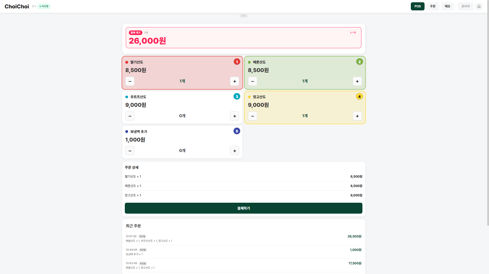
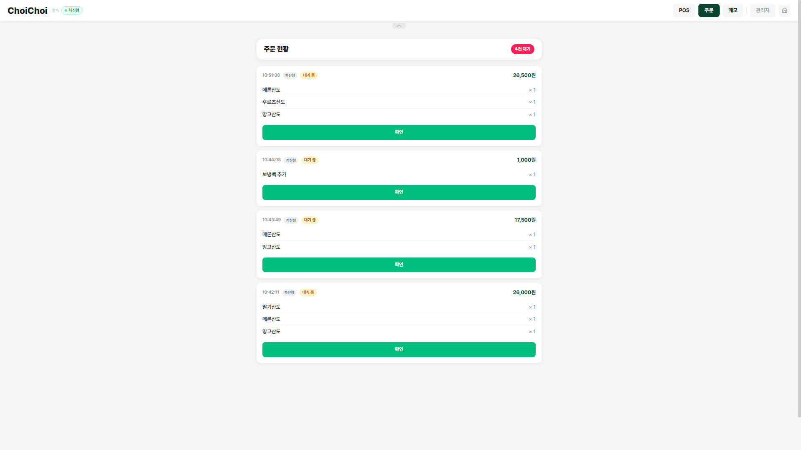
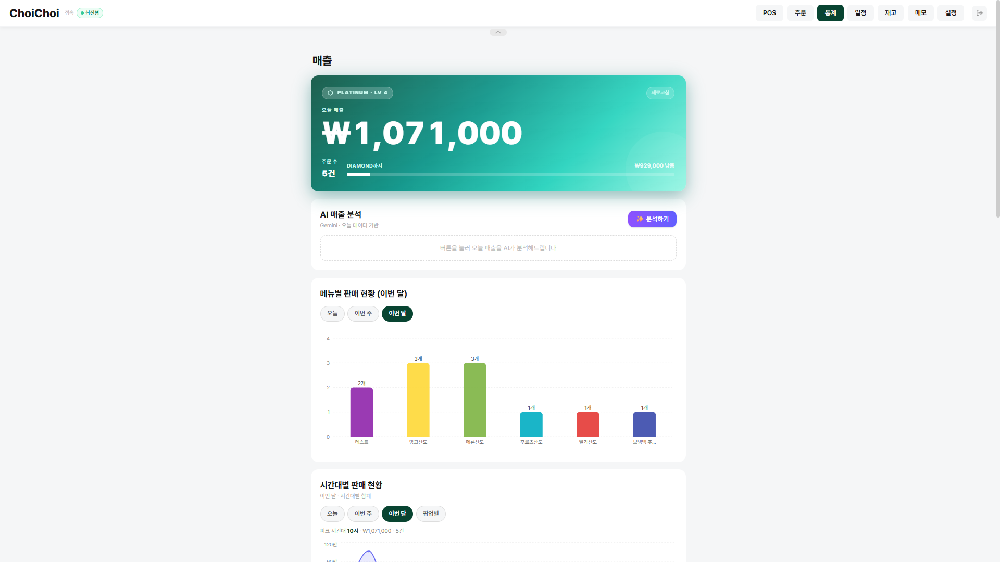
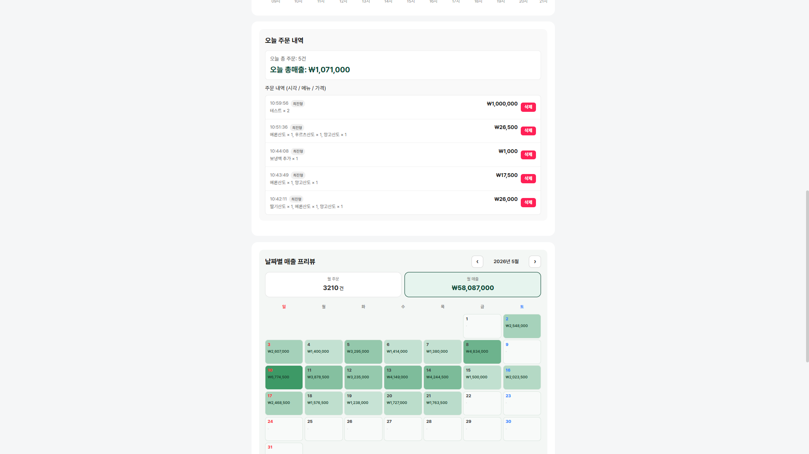
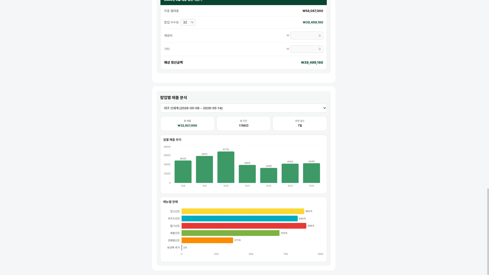
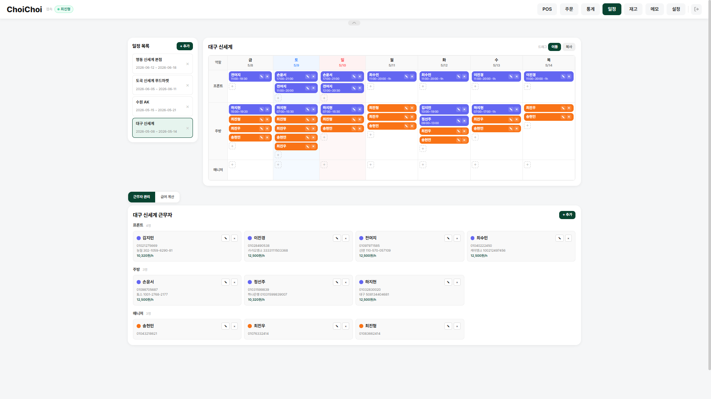
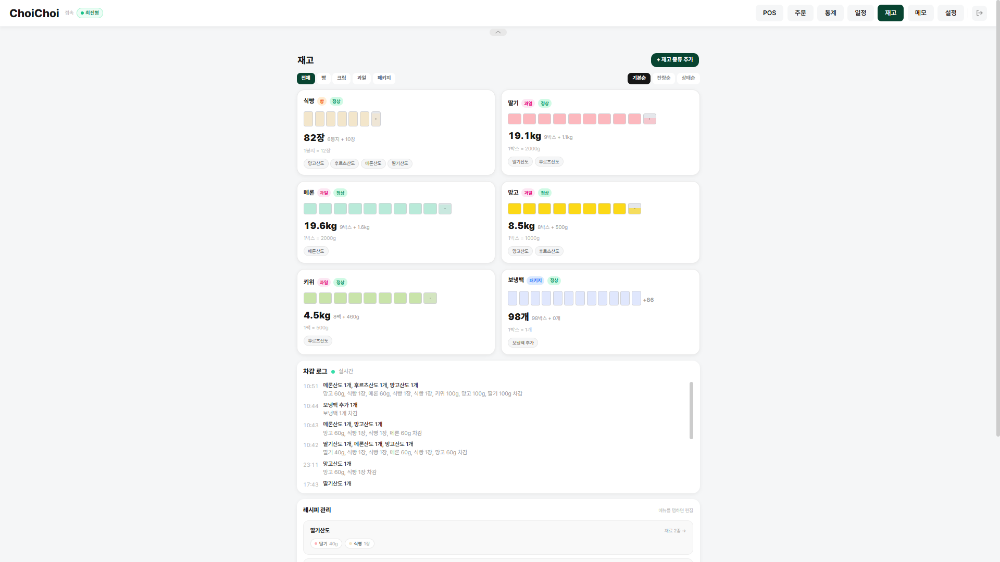
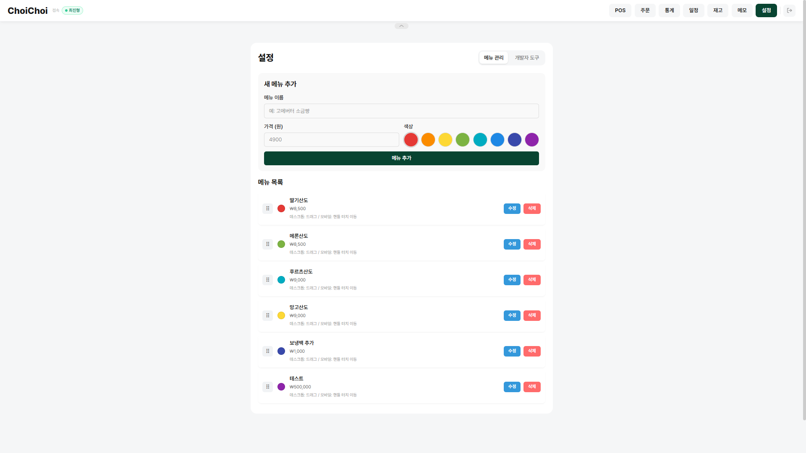

# Hiyorisando POS · ERP

English | [한국어](README.ko.md)

An **in-house web POS + lightweight ERP** built for the real store operations of **Hiyorisando** — [@Hiyorisando_official](https://www.instagram.com/hiyorisando_official/) — a bakery brand that runs pop-up stores nationwide. This isn't a demo or a portfolio project; it's a system in daily production use for checkout and settlement across multiple pop-up locations.

It covers the full back-office workload a pop-up store operation needs in one system: order entry and checkout (POS), inventory management, HR management (candidate tracking, per-part roster assignment, automated payroll settlement, e-signed employment contracts), and sales analytics.

---

## Core features

| Module | Description |
|--------|-------------|
| **POS** | Touch/keyboard-friendly cashier checkout screen, real-time per-menu stock deduction, tier-based revenue banners and confetti |
| **Customer display** | Real-time cart mirroring screen relayed purely over WebSocket, no checkout capability |
| **Order status** | View completed orders, toggle preparation status |
| **Inventory** | Dual-unit tracking of sealed/opened ingredient remainders, restock history |
| **HR management (HRM)** | Manage candidate/active/rejected worker status, per-popup/per-part roster assignment (drag-free optimistic-update grid); workers active at multiple stores are tracked via an N:M popup-assignment history table |
| **Payroll** | Paid work-hour calculation with automatic break-time deduction, per-worker settlement amounts |
| **E-signed employment contracts** | Standard employment contract PDF generated and previewed server-side in real time, signed by workers directly in the app |
| **Schedule** | Read-only unified kitchen/store roster view for managers, plus per-date memos |
| **Sales analytics** | Today's/period sales, per-menu and per-hour breakdowns, monthly calendar, per-popup settlement |
| **Notifications** | Discord webhook auto-notifications for contract signing, logins, and next-day shift digests (Vercel Cron) |

---

## Screenshots

<table>
  <tr>
    <td align="center"><b>POS checkout screen</b><br/></td>
    <td align="center"><b>Order status</b><br/></td>
  </tr>
  <tr>
    <td align="center"><b>Sales analytics — today, per-menu, per-hour</b><br/></td>
    <td align="center"><b>Sales analytics — order history, monthly calendar</b><br/></td>
  </tr>
  <tr>
    <td align="center"><b>Sales analytics — per-popup breakdown & settlement</b><br/></td>
    <td align="center"><b>Schedule — per-part roster assignment</b><br/></td>
  </tr>
  <tr>
    <td align="center"><b>Inventory — ingredient stock in/out</b><br/></td>
    <td align="center"><b>Settings — menu CRUD, popup management</b><br/></td>
  </tr>
</table>

---

## Tech stack

| Area | Technology | Why |
|------|-----------|-----|
| Framework | Next.js 16 (App Router) | Server Actions minimize the server/client boundary; no separate API server needed |
| Language | TypeScript 6 | End-to-end type safety for Server Action return types, all the way to the client |
| UI | React 19 + Tailwind CSS 4 + Framer Motion | Declarative animation alongside server components |
| Server state | TanStack Query v5 | Optimistic updates + query cache invalidation |
| Form validation | Zod | Schema validation of Server Action inputs |
| Charts | Recharts | Sales analytics visualization |
| Auth | Supabase Auth (email + password) | 3-tier role system (admin > manager > user), route-level protection in `proxy.ts` |
| Realtime | Supabase Realtime Broadcast + Presence | No need to manage WebSocket infrastructure directly; fully compatible with Vercel serverless |
| Database | Supabase (PostgreSQL) | Principle of least privilege via RLS + separated service role |
| PDF generation | @react-pdf/renderer + pdfjs-dist | Server-side rendering of employment contracts; preview reuses the same component (mobile falls back to pdfjs-dist canvas rendering since iframe PDF viewers aren't supported) |
| Testing | Vitest | Unit tests for pure logic like payroll and work-hour calculations |
| Deployment | Vercel | Edge network + Cron (next-day shift assignment Discord digest) |

---

## Architecture decision records

### Server Actions vs API Routes
**Decision:** Unify all DB calls under Server Actions (`app/actions/`); admin-only actions re-verify the role inside the action itself.
**Why:** API Routes require a separate `fetch` call and serialization, while Server Actions can be used like plain function calls and aren't included in the client bundle. A single `wrap()` helper handles all errors consistently as `ApiResponse<T>`. However, a Server Action is effectively a public POST endpoint, so `proxy.ts`'s page-level protection doesn't apply to it — sensitive actions (permission changes, PII lookups) directly re-check the role inside the action itself via the `requireAdmin()` / `getManagerSession()` pattern.

```
app/actions/
├── _base.ts        # wrap() helper, shared error handling
├── menu.ts          # Menu CRUD
├── orders.ts        # Order save/query/delete
├── stats.ts         # Sales analytics, manual sales entry
├── inventory.ts      # Stock deduction/restock
├── schedule.ts        # Popup (store) CRUD
├── staff.ts            # Candidate/active worker profile management
├── staffPopups.ts       # Worker ↔ popup many-to-many assignment
├── roster.ts              # Part definitions, per-date assignment, tier ranking
├── roster-view.ts          # Manager-facing unified read-only schedule view
├── payroll.ts                # Payroll settlement calculation
├── workers.ts                 # Staff accounts/profiles, invite-code signup
├── contracts.ts                # Employment contract creation, e-signature, deletion
├── pos-note.ts                  # POS announcement memo
├── discord.ts                    # Discord notifications
└── memos.ts                       # Operations memos
```

### Migrating from a temporary password/token scheme to a unified Supabase Auth system
**Decision:** Retire the env-based staff password + localStorage token scheme in favor of unifying all staff and admins under Supabase Auth (email + password) accounts, introducing a 3-tier role system (`admin > manager > user`).
**Why:** The old scheme became more cumbersome to operate as headcount grew (shared passwords), and the server had no way to identify who was actually logged in. After the switch to Supabase Auth, the source of truth for roles lives in `user_profiles.worker_role` and is synced to `user_metadata.role` on login. Signup is gated by invite code only. Initial passwords are set to the worker's phone number so onboarding requires no separate instructions, and if forgotten, an admin can instantly reset it to that default from the Settings tab.

### Broadcast vs DB polling
**Decision:** Use Supabase Realtime Broadcast for cart state synchronization.
**Why:** The cart is ephemeral data until checkout — there's no reason to persist it in the DB. Broadcast relays over WebSocket with no DB I/O, and is unaffected by Vercel serverless function restarts.

### Service role key isolation
**Decision:** Isolate `lib/supabase-admin.ts` as a separate module.
**Why:** This physically prevents accidental `NEXT_PUBLIC_` prefix mistakes. Because the file itself is only imported from Server Actions, it can never end up in the client bundle. The roles of the anon client (`supabase-browser.ts`, `supabase-server.ts`) and the admin client (`supabase-admin.ts`) are cleanly separated at the code level.

### Employment contract PDFs — server-rendered, with the original JSONB payload retained
**Decision:** PDFs are always generated server-side (via `@react-pdf/renderer`'s `renderToBuffer`), and the entire form data as filled in at authoring time is stored alongside it in `contracts.contract_data` (JSONB). `contracts.worker_id` only ever references `staff_profiles.id`, the single source of truth for workers.
**Why:** When a worker e-signs, every field the employer entered (hourly rate, work days, insurance enrollment, etc.) must be preserved exactly, with only the signature data appended, in order to regenerate the PDF. The preview (`PDFPreviewPanel`) reuses the same `ContractDocument` component client-side, eliminating any visual mismatch between the authoring screen and the final PDF. Workers used to be split across an event-scoped table (`workers`) and an account-scoped table with independent id spaces, which once caused data corruption from id collisions — this was consolidated into a single reference to `staff_profiles`.

### Modeling multi-store workers — an N:M join table
**Decision:** A worker's "current popup" stays a single value on `staff_profiles.popup_id` (cashier-only), while the history of popups they've worked across is tracked separately in `staff_popup_assignments` (worker ↔ popup many-to-many).
**Why:** Given the nature of pop-up stores, it's common for one person to work at different stores across different periods. A single popup value alone can't represent past work history, so the "add existing worker" feature in the HR tab was designed specifically around this join table.

### Soft delete
**Decision:** Deleting a menu item sets `is_active = false`.
**Why:** `order_items.menu_item_id` references `menu_items.id` as a foreign key. A hard delete would break that FK for past orders, making sales aggregation impossible. Soft delete permanently preserves order history and revenue integrity.

---

## Realtime sync architecture

The cashier and customer-facing screens relay over Supabase Realtime Broadcast via WebSocket with no DB persistence, and are fully compatible with Vercel serverless.

```
Cashier (/pos)                               Customer (/display)
┌────────────────────────┐                  ┌────────────────────────┐
│  counts state changes   │  cart_update     │  View mode             │
│  → sends cart_update    │ ──── Broadcast ──→│  Real-time cart mirror │
│                        │                  │  Shows color/qty/total  │
│  receives customer_update│←─── Broadcast ───│  Order mode            │
│  → updates counts        │  customer_update  │  Menu tap → sends delta│
└────────────────────────┘                  └────────────────────────┘
       │  checkout_complete ──────────────────────────────→ Checkout complete overlay
       │                                                    + confetti animation
       └── Presence ──────────────────── Live list of connected cashiers

Channels: orders-{popupId}, cart-display-{popupId}, pos-presence-{popupId},
          pos-note-*(+ pos-note-editors Presence), inventory-*, stats-today-*, menu-items-stock-*
```

---

## Auth & security design

```
proxy.ts (Next.js 16, replaces middleware.ts — creating both causes a conflict, so
          middleware.ts must never be created)
  admin only:      /stats, /hr, /settings
  manager+:        /inventory, /roster
  Behavior: validates the JWT locally on every request via supabase.auth.getClaims()
            (asymmetric key, JWKS cached in-instance) — eliminates the per-request
            Auth-server round trip that getUser() requires
            Unauthenticated or insufficient role → redirect to /pos

app/password-gate.tsx (client, wraps the whole app)
  Public paths (bypassed): /, /display
  Login: supabase.auth.signInWithPassword() → looks up user_profiles.worker_role
         → syncs to user_metadata.role (admin/manager/user)
  Signup: createWorkerAccount() Server Action — after invite-code verification,
          creates the Auth account + inserts into user_profiles; initial
          password = phone number

app/(admin)/layout.tsx, app/(staff)/layout.tsx (server components)
  Additional protection via getSession() — since proxy.ts has already
  validated the session, reading cookies directly is sufficient without
  the network round trip getUser() would require

Server Action self-guards
  proxy.ts only protects page routes — a Server Action is effectively a
  public POST endpoint, so sensitive actions (permission changes, PII
  lookups, password resets, etc.) re-verify the session and role directly
  inside the action via the requireAdmin() / getManagerSession() pattern
```

**Client/server key isolation**

```
lib/supabase-browser.ts  ← ANON_KEY, client-side login/signup/storage uploads
lib/supabase-server.ts   ← ANON_KEY, auth checks in server components/actions
lib/supabase-admin.ts    ← SERVICE_ROLE_KEY, imported only from Server Actions
lib/supabase.ts          ← ANON_KEY, dedicated singleton for client realtime channels
```

`supabase-admin.ts` is a server-only module and is never included in the client bundle.

**Sensitive data encryption** — highly sensitive personal data such as national ID numbers is encrypted at rest with `PII_ENCRYPTION_KEY`, and only masked values are ever shown on screen.

---

## User roles

| Role | Description | Accessible routes |
|------|-------------|-------------------|
| **Guest** | Ordering customer | `/display` |
| **Staff** (user) | Cashier / kitchen worker | `/pos`, `/orders`, `/memo`, `/my`, `/my/schedule` |
| **Manager** | On-site manager | All of the above + `/inventory`, `/roster` |
| **Admin** | Overall operations lead | All routes + `/stats`, `/hr`, `/settings` |

All roles share the same Supabase Auth account system; permissions are distinguished solely by `user_metadata.role`. The role read on the client is only used to decide what to show in the UI — actual access control is entirely enforced by `proxy.ts` and the in-action guards in Server Actions.

---

## Project structure

```
app/
├── page.tsx                    # Landing — role selection (no auth required)
├── proxy.ts                    # Route session validation (Next.js 16, replaces middleware.ts)
├── password-gate.tsx           # Login/signup gate (Supabase Auth)
├── providers.tsx                # TanStack Query provider
├── actions/                     # Server Actions — split by domain (see ADRs above)
├── pos/                          # Cashier POS main screen
├── display/                       # Customer display (view/order modes, no auth required)
├── orders/                         # Order status
├── memo/                            # Operations memos
├── my/                               # My info — edit profile, order stats, view/sign contracts
├── my/schedule/                       # Worker-facing personal shift schedule view
├── api/cron/daily-schedule/            # Vercel Cron — next-day shift assignment Discord digest
├── (admin)/                             # Protected by proxy.ts + layout.tsx (admin only)
│   ├── stats/                            # Sales analytics (split into custom hooks/components)
│   ├── settings/                          # Menu/popup management + user basics + dev tools
│   └── hr/                                 # HR — candidate/active management, roster assignment,
│                                             payroll settlement, contract authoring/signing/listing
└── (staff)/                               # Protected by proxy.ts + layout.tsx (admin, manager)
    ├── inventory/                          # Inventory (ingredients, stock in/out log)
    └── roster/                              # Schedule — read-only full roster view + per-date memos

components/
├── NavBar.tsx                   # Navigation — links shown vary by role tier
├── SalesBanner.tsx               # Today's revenue banner (tier-based gradient)
├── PosNoteWidget.tsx              # POS announcement memo widget (realtime sync + Presence)
├── WorkerSignModal.tsx             # Worker e-signature modal
├── PDFPreviewPanel.tsx              # Live PDF preview built on usePDF
├── ContractDocument.tsx              # Standard employment contract PDF template
└── SignaturePad.tsx                   # Canvas signature input

lib/
├── supabase-browser.ts / supabase-server.ts / supabase-admin.ts / supabase.ts
├── workhours.ts                  # Pure functions for payroll/paid-hour calculation (auto break deduction)
├── staffing.ts                    # Roster assignment candidate filtering/sorting
├── tiers.ts                        # Revenue tier system definitions
├── discord.ts                       # Discord webhook notifications
└── utils.ts / date.ts                # Formatting / KST date utilities

types/
├── api.ts                        # ApiResponse<T> and each action's return type
└── database.ts                    # Supabase table interfaces
```

---

## Database schema

20 tables on Supabase (PostgreSQL).

### Core domain

| Table | Key columns | Notes |
|-------|-------------|-------|
| `menu_items` | `id`, `name`, `price`, `color` (hex), `stock`, `is_active`, `display_order` | Soft delete |
| `orders` | `id`, `total_price`, `payment_method`, `payment_status`, `cashier_name`, `is_prepared`, `popup_id`, `created_at` | KST filtering is applied at query time |
| `order_items` | `order_id`, `menu_item_id`, `quantity`, `unit_price`, `subtotal` | Kept for FK integrity |
| `popup_events` | `id`, `name`, `start_date`, `end_date`, `is_active` | The popup name itself doubles as the store identity |
| `daily_sales` | `sale_date` (UNIQUE), `total_revenue`, `total_orders`, `note` | Manual sales entry |

### Inventory

| Table | Key columns | Notes |
|-------|-------------|-------|
| `ingredients` | `id`, `name`, `category`, `unit_type` (`count`\|`weight`), `sealed_count`, `opened_remaining`, `reorder_at_containers` | Dual unit: sealed containers / opened remainder |
| `restock_events` | `id`, `ingredient_id`, `sealed_delta`, `opened_delta`, `note`, `created_by` | Manual restock log |

### HR, roster & payroll

| Table | Key columns | Notes |
|-------|-------------|-------|
| `user_profiles` | `id`, `name`, `phone`, `bank_name`, `bank_account`, `worker_role`, `resident_reg_no_enc/masked` | 1:1 with Auth account, source of truth for role |
| `staff_profiles` | `id`, `name`, `staff_role` (`kitchen`\|`cashier`), `popup_id`, `status` (`candidate`\|`confirmed`\|`inactive`), `hourly_rate`, `user_profile_id` | Single source of truth for workers |
| `staff_popup_assignments` | `staff_id`, `popup_id` | Worker ↔ popup many-to-many assignment |
| `roster_shifts` | `id`, `staff_role`, `popup_id`, `name`, `start_time`, `end_time`, `break_minutes` | Part definitions |
| `roster_shift_requirements` | `work_date`, `shift_id`, `required` | Required headcount per date |
| `roster_assignments` | `work_date`, `shift_id`, `staff_id`, `staff_role`, `popup_id`, `start_time`, `end_time`, `break_minutes` | Actual per-date assignment |
| `contracts` | `id`, `worker_id` (FK → `staff_profiles.id`), `popup_id`, `hourly_rate`, `pdf_url`, `contract_data` (jsonb), `worker_signed_at` | Employment contract; PDF lives in a private Storage bucket |
| `roster_memos` | `memo_date`, `content`, `author_name` | Per-date schedule memos |

### Operations

| Table | Key columns | Notes |
|-------|-------------|-------|
| `memos` | `id`, `title`, `content`, `color`, `is_pinned`, `type` (`note`\|`checklist`) | Cashier operations memos |
| `pos_note` | `content`, `updated_by`, `updated_at` | POS announcement, always a single row |
| `manual_menu_sales` / `manual_daily_menu_sales` / `manual_hourly_sales` | `popup_id`, `menu_item_id`/`hour`, `quantity`/`total_revenue` | Manual sales-correction entries per popup |

**Key design decisions:**
- `menu_items.is_active = false` — soft delete, preserves `order_items` FK integrity
- `orders.created_at` — converted to KST at query time (`getKSTDateBounds()`)
- `daily_sales.sale_date` UNIQUE constraint — guarantees upsert-on-conflict semantics
- `contracts.contract_data` (JSONB) — storage for reconstructing the original form data at signing time, to regenerate the PDF
- Work-hour calculations go through a single canonical pure function in `lib/workhours.ts` — payroll settlement, the schedule view, and per-worker totals all reuse the same function, eliminating any chance of the amount differing between screens

---

## Environment variables

Copy `.env.example` to `.env`:

```bash
cp .env.example .env
```

| Variable | Purpose | Exposure |
|----------|---------|----------|
| `NEXT_PUBLIC_SUPABASE_URL` | Supabase project URL | Public (browser) |
| `NEXT_PUBLIC_SUPABASE_ANON_KEY` | Supabase anon key | Public (browser) |
| `SUPABASE_SERVICE_ROLE_KEY` | Admin key that bypasses RLS | **Server only** |
| `SIGNUP_CODE` | Invite code required for signup | Server only |
| `PII_ENCRYPTION_KEY` | Encryption key for highly sensitive data such as national ID numbers (32 bytes, base64) | **Server only** |
| `DISCORD_WEBHOOK_URL` | Notifications for menu changes / contract signing / login / shift digests (optional) | Server only |
| `CRON_SECRET` | Bearer auth for the Vercel Cron endpoint (`/api/cron/daily-schedule`) | Server only, required in production |

Register admin accounts directly in the Supabase dashboard under Authentication → Users, then set `user_profiles.worker_role` to `admin`.

---

## Running the project

```bash
yarn install
yarn dev      # http://localhost:3000
yarn build    # Production build (includes TypeScript type checking)
yarn lint     # ESLint check
yarn test     # Vitest — unit tests for pure logic like payroll and work-hour calculations
```
